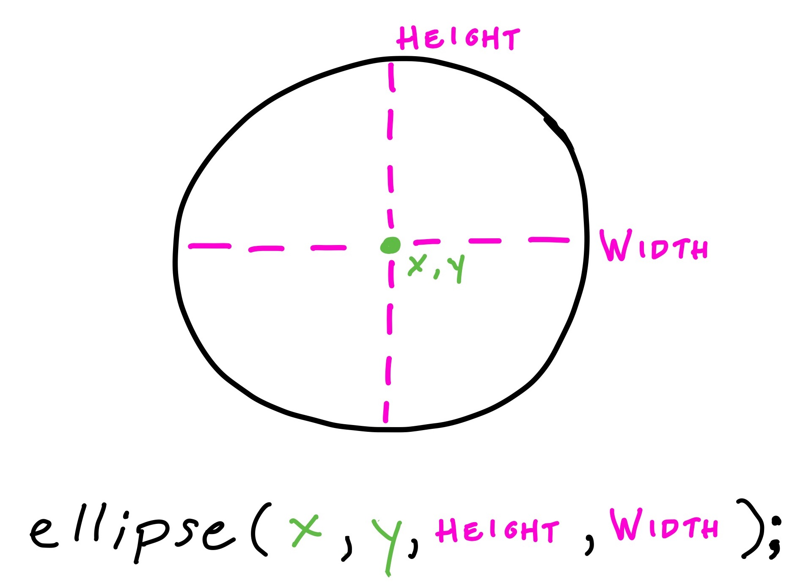

# Drawing Circles

In p5, we can use the `ellipse` function to create both circles and ovals.

The `ellipse` function needs 4 parameters for placement and size.

```javascript
ellipse(x, y, width, height)
```



* `x` - a number, the horizontal position on the screen
* `y` - a number, the vertical position on the screen
* `width` - a number, how wide the ellipse should be.
* `heihgt` - a number, how tall the ellipse should be.

The center of the ellipse with be at the x y position given.

Here is the code to draw a circle at the location 100, 100 with a size of 200.
```javascript
ellipse(100, 100, 200, 200)
``` 
 
Here is the code to draw an oval that is wider than it is tall.  
```javascript
ellipse(100, 100, 200, 100)
``` 
 
## Try it out!
Try drawing 3 different circles or ovals in the [p5 editor](https://editor.p5js.org/)

