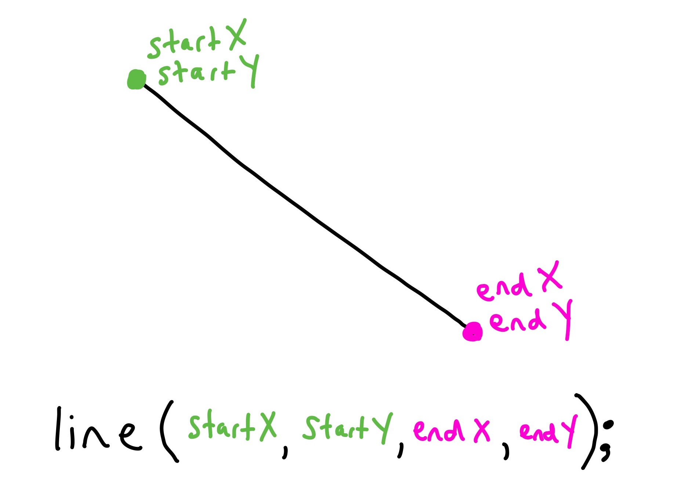

# Drawing Lines
In p5, we can use the `line` function to draw a line between two points.

The `line` function takes in 4 parameters for the start and end of the line.

```javascript
line(startX, startY, endX, endY)
```



* `startX` - a number, the x location for the start of the line.
* `startY` - a number, the y location for the start of the line.
* `endX` - a number, the x location for the end of the line.
* `endY` - a number, the y location for the end of the line.

Here is the code to draw a line from the top left to the bottom right.
```javascript
line(50, 50, 350, 350);
```

Here is another example that will draw a horizontal line.
```javascript
line(50, 20, 50, 380);
```

## Try it out!
Try drawing 3 different lines in the [p5 editor](https://editor.p5js.org/)
