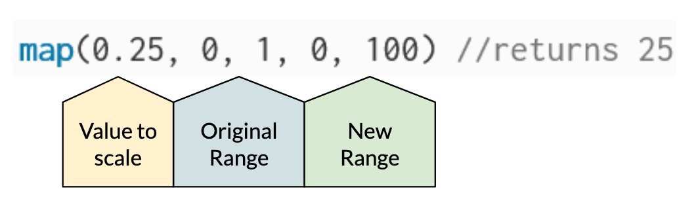
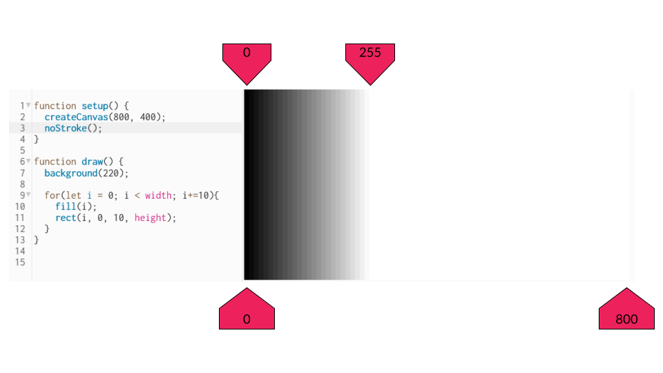
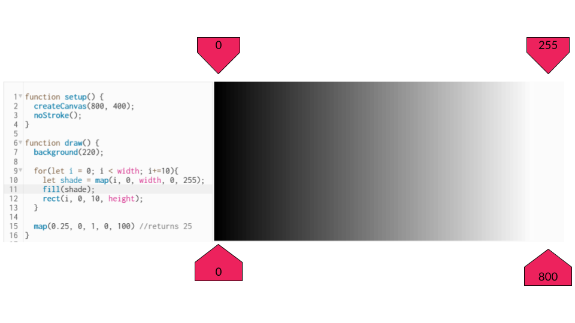

# Map Function
The `map` function is incredibly useful and takes care of some nasty math.

The purpose of the map function is to "map" a value from one range to a new range. 
Effectively this is used to scale.

Here is a simple example, so simple that we would probably do this without `map`, but you'll see how it works!

```javascript
map(0.25, 0, 1, 0, 100); //returns 25
```
The first parameter is the value to scale. The next two parameters are the original range. The next two are the new range to map to.



## A More Useful Example
Say we wanted to make a gradient color fade the stretched across the width of the canvas. Maybe we start with something like this.


 
You notice, once `i` reaches 255, the shade is 100% white and the fade stops there. We want the fade to stretch from the left hand to the right, we can use `map` to achieve this!


 
## More Complex Example, with Animation!

If we wanted to have a shape move back and forth (oscillation) we could use `cos()` which returns a value between -1 and 1.

```javascript
let motion = 0.0;

function setup() {
  createCanvas(400, 400);
}

function draw() {
  background(220);

  let x = cos(motion); //cosine returns a value between -1 and 1

  ellipse(x, 200, 50, 50)

  motion += 0.01; //update angle
}
```

If you run this code you will see that it works, but the x value only ranges between -1 and 1. 


The range should be the left side of the screen (0px), to the right (400px). Here `map` could be really useful!
```javascript
let motion = 0.0;

function setup() {
  createCanvas(400, 400);
}

function draw() {
  background(220);
  
  let x = map(cos(motion), -1, 1, 0, width); //map the cosine value to a new range!
  
  ellipse(x, 200, 50, 50)
  
  motion += 0.01; //update angle
}
```


