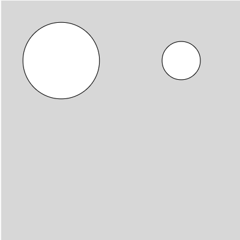
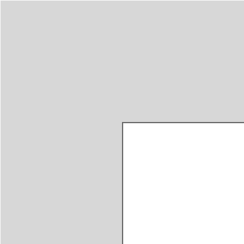
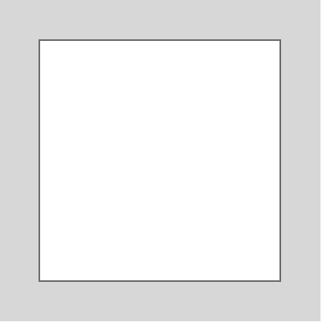

# Math!

This guide assumes you know about variables, if you don't know about variables checkout [this guide](./variables.md) before going on!

## Basics Operations
p5 knows math. You can add, subtract, divide and more!
- `+` adds values together
- `-` subtracts values
- `*` multiplies values
- `/` divides values

For example, the line below would add 10 and 5 then store the value 15 in the variable sum.
```javascript
let sum = 10 + 5;
```

You might be thinking this is silly, because we could have just wrote `let sum = 15;` and you'd be write. So lets a better example.
 
Say I want to draw two circles, one half the size of the other. I could write this...
```javascript
ellipse(100, 100, 100, 100); //a circle 100px wide by 100px tall
ellipse(300, 100, 50, 50); //a circle 50px wide by 50px tall
```
But anytime that I change my mind on the size of the circle, I have to do the math and change the second circle. This is fine for easy values, but what if the I want the first circle to be 127.5px in size, then I have to do that math!

Instead, I could let p5 do the division instead.

```javascript
let circSize = 127.5;
ellipse(100, 100, circSize, circSize);
ellipse(300, 100, circSize/2, circSize/2);
```



## Math with built in variables
p5 can also do math with the built in variables that you learnt about in the previous guide.

For example, I want a circle to be in the middle of the canvas. When the canvas is 400 by 400, that is easy math, I could just put it at 200, 200.
```javascript
ellipse(200, 200, 300, 300); //a cirlce in the middle of the canvas.
```

But say later I decide the canvas should be 600, by 600, then I would have to go and update my values. This is fine for one circle, but what if I had a bunch of shapes all centered in the canvas, that is more work!

It would be better to use the `width` and `height` variables to always put the shape in the center, no matter the canvas size! Here is how...
```javascript
ellipse(width/2, height/2, 300, 300);
```
Now, even if the canvas size changes, the circle will always be centered!

## Centering a Rect
I want to draw a square in the center. So I could try this.
```javascript
rect(width/2, height/2, 300, 300);
```
Here is how that looks!



Remember, rectangles place the top left corner at the x y position given. But I can do a little fancy math to center it!
```javascript
let squareSize = 300; //variable for the size
rect(width/2 - squareSize/2, height/2 - squareSize/2, squareSize, squareSize); //moves the square half way left and up.
```



## Updating a variable
It is really common to take a variable, do some math to update it, and then store it again.

For example, this code will draw a circle at the center that gets 1px bigger each time draw updates.

```javascript
let circSize = 1;
ellipse(width/2, height/2, circSize, circSize); //draw a circle in the center

//update the size!
circSize = circSize + 1; //increase the size by 1, then reset circSize
```

This would do the same thing, just a little easier, `circSize++`


