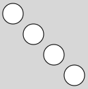
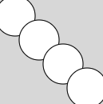
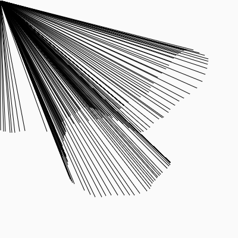

# Variables

In p5, a variable is a placeholder to store any value. 

We **declare** a variable using the word `let`.

This line declares a new variable called circSize.
```javascript
let circSize;
```
We can **assign** a value to the variable using a `=` sign.
```javascript
circSize = 30;
```
But we don't say "circSize equals 30". We would say "circSize gets assigned to 30."

We can **declare** and **assign** in a single line! This is VERY common!
```javascript
let circSize = 30;
```
 
Once a variable is declared, it can be used over and over again.
```javascript
let circSize = 30;
ellipse(20, 20, circSize, circSize);
ellipse(50, 50, circSize, circSize);
ellipse(80, 80, circSize, circSize);
ellipse(110, 110, circSize, circSize);
```



By changing the value of the variable once, it changes everywhere that it is used!
```javascript
let circSize = 50;
```



A variable can hold any type of data, not just numbers! This code would store text, called a String value, and use it to display text to the canvas.
```javascript
let name = "Adam";
text(name, 20, 20);
```
## Built-in Variables
p5 creates a lot of useful variables once a sketch is started!

Here are some examples...
- `mouseX` is the x position of the mouse.
- `mouseY` is the y position of the mouse.
- `width` is the width of the canvas.
- `height` is the height of the canvas.
- `frameCount` is how many times draw has repeated.

We can use this variables anywhere inside `draw`. For example this code will always draw a line from (0,0) to the mouse location.
```javascript
line(0, 0, mouseX, mouseY);
```

