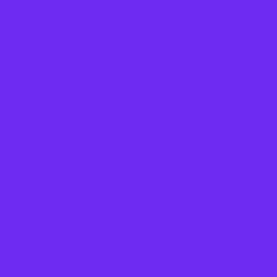
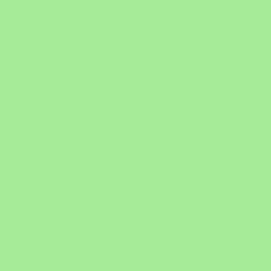
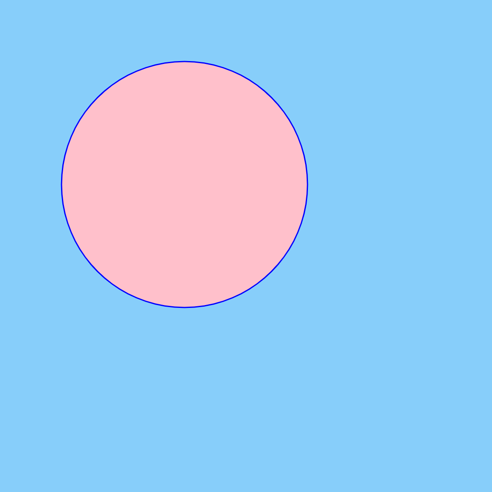
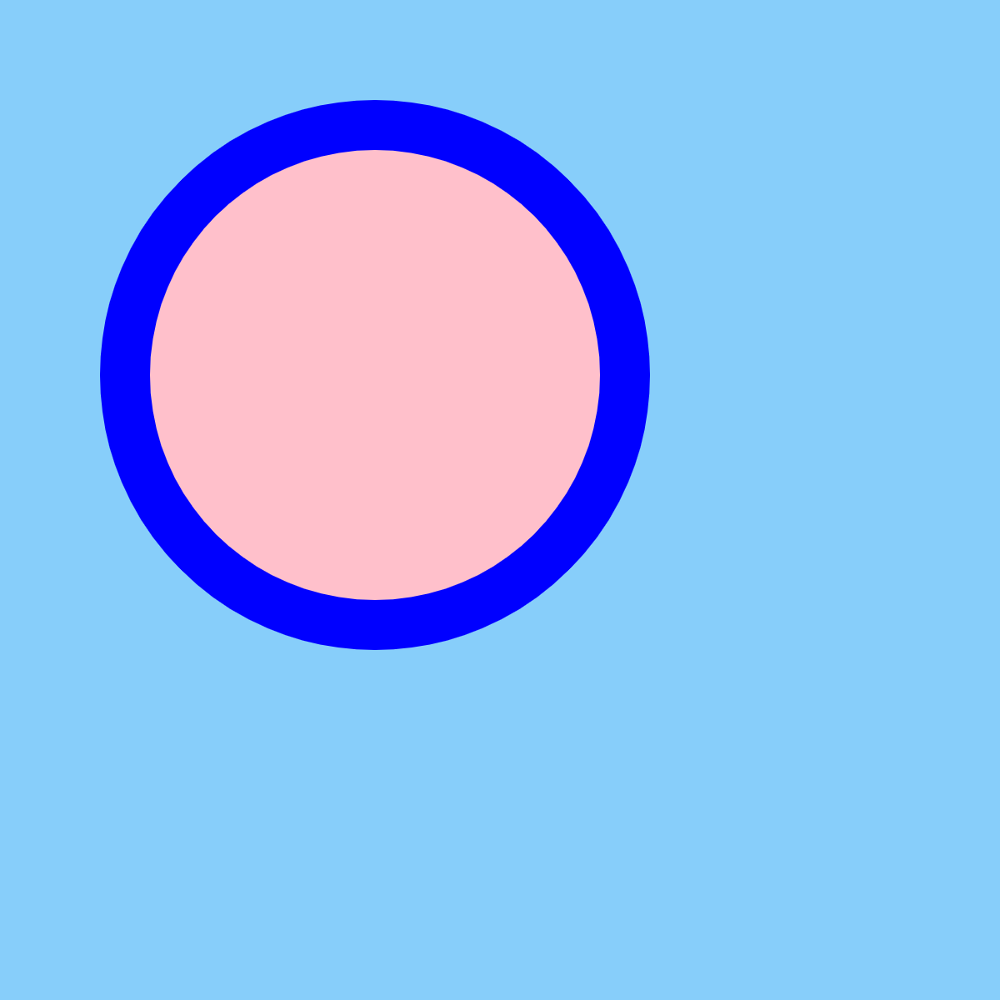
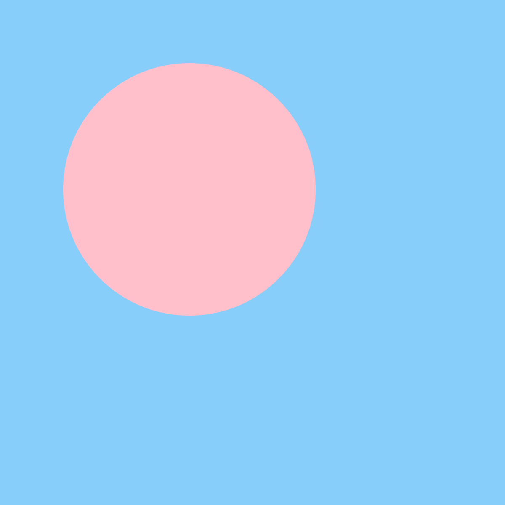

# Color
In p5, there are multiple ways to change colors.

## Fill
To change the color of a shape, we need to change it's fill using the `fill` function.

`fill(value)` will set the color to a shade of grey. 0 will be black, 255 will be white.

`fill(redValue, greenValue, blueValue)` will set the fill to be any color. For each value, 0 means none of that color, 255 means full color.

`fill(123, 3, 252)` will produce a purple color because there is a some read, very little green, and lots of blue.
 


Fill can also take in the name of a color. It will understand any of the [HTML Color Names](https://www.w3schools.com/tags/ref_colornames.asp)

`fill("lightGreen")` will make this green color. The name has to be in quotes
 


But fill can also understand HEX color values!

`fill("#87CEFA")` will make this blue color. Again, the color value has to be in quotes. 
 

 
## Stroke
We can also change the outline of a shape using the `stroke` function. Like `fill`, `stroke` will take in any of the color methods mentioned about.

This will draw an ellipse with a blue outline and a pink fill.
```javascript
stroke("blue");
fill("pink");
ellipse(100, 100, 200, 200);
```



To make the outline thicker, we can increase the stroke weight using the `strokeWeight` function. This function takes one number value. 

Adding the stroke weight.

```javascript
stroke("blue");
strokeWeight(20);
fill("pink");
ellipse(150, 150, 200, 200);
```


 
If we don't want any outline, we can use `noStroke()`. 
```
noStroke();
fill("pink");
ellipse(150, 150, 200, 200);
```

