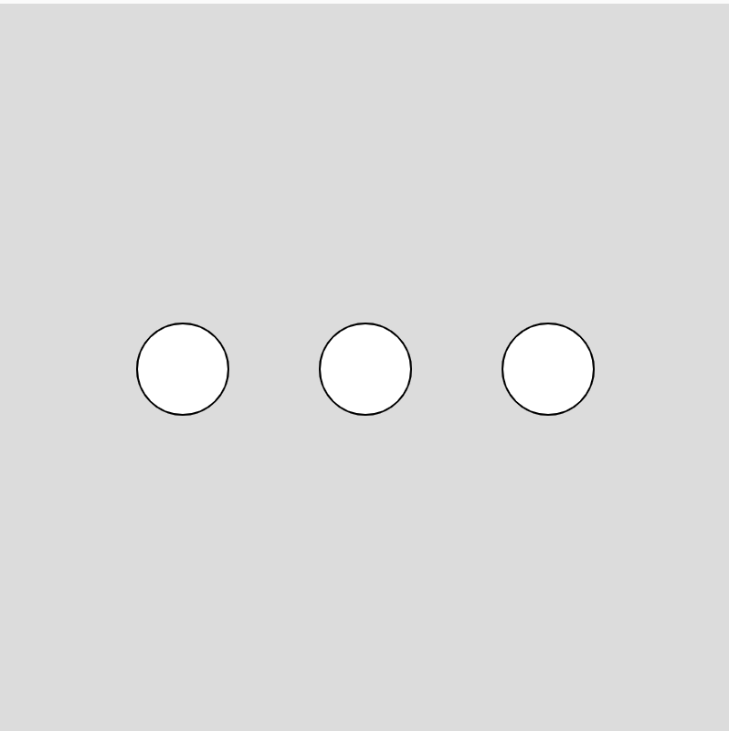
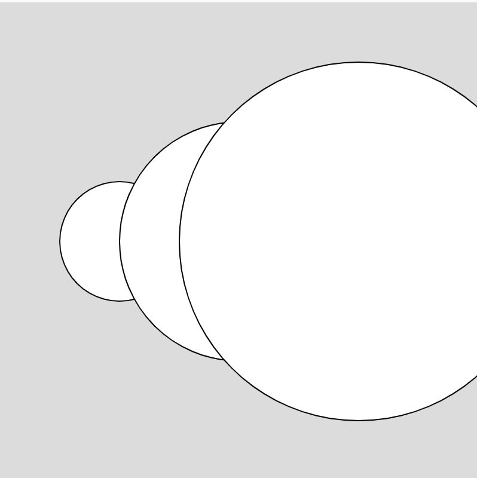
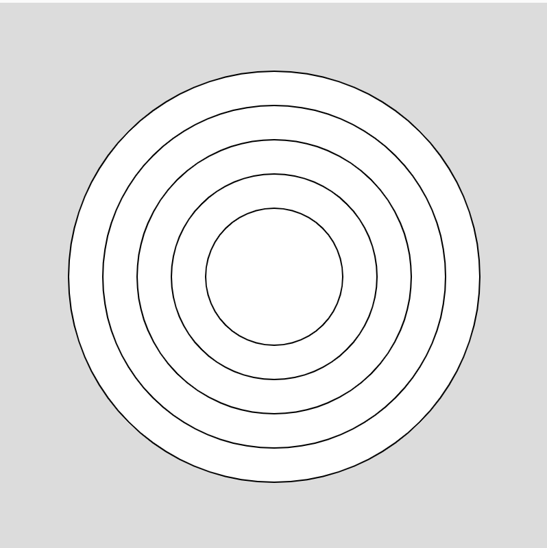

# For Loops!

For loops are one of the most important programming patterns to master. They allow you to easy repeat code or travel over a list of items.

The for loop is defined with three things.
1. A variable, example `let x = 100`
2. A condition to check for truthiness, example `x < 400`
3. An update to the variable, example `x = x + 100`

Any code that is inside the `{}` of the for loop will be repeated.

Let's look at a simple example...
```javascript
for(let x = 100; x < 400; x = x + 100){
  ellipse(x, 200, 50, 50);
}
```



The variable can be used in many different ways, it doesn't just have to change the position.

Here, the variable is used to affect the size
```javascript
for (let x = 100; x < 400; x = x + 100) {
ellipse(x, 200, x, x);
}
```


## Counting Down
The variable, condition and update can take many different forms. Here, we are counting down, making the size a little smaller each time.

```javascript
for(let s = 300; s >= 50; s = s - 50){
ellipse(200, 200, s, s);
}
```

