# Drawing a Heart in p5

## Part 1 - Drawing a Heart
In the first part, you will see how to draw a heart shape by combining a circle and two squares. [Link to Video](https://youtu.be/JfBjqjl2zmk)

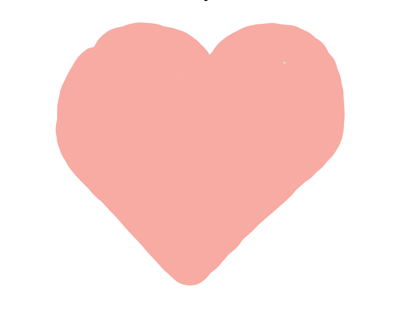

There is no heart function in p5. So to draw a heart we have to make it ourselves from other simple shapes. As you see here, we can make a heart from two circles and a rectangle!


To start we are going to drawing the heart on its side, then rotate it upright.
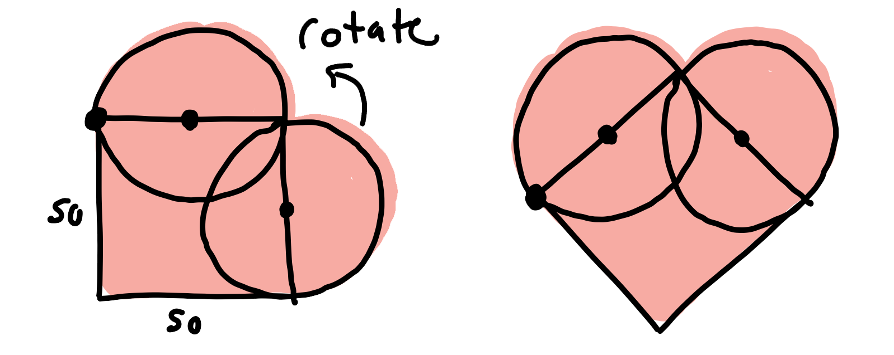

Let's get started!

## Drawing the heart shape
First, lets draw a square, right now I'm not worried about placement, I'll show how to move it later!

```javascript
rect(50, 50, 50, 50);
```
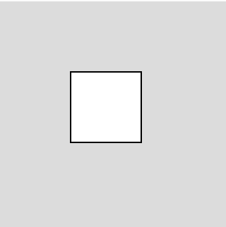

This draws a square that is at x: 50, y: 50 and has a width and height of 50.

Next, I'm going to add a circle on the top. Remember `rect` draws from the corner and `ellipse` from the middle. So I'm going to move the x value of the circle by 25, or half the size, to center it with the square.

```
rect(50, 50, 50, 50);
ellipse(75, 50, 50, 50);
```

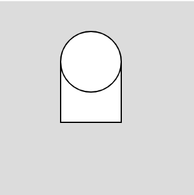

Now, I'm going to draw another circle at the right. This time I'm going to add another 25, again this is half the size, to the x location. I will also add 25 to the y to move it down.
```
rect(50, 50, 50, 50);
ellipse(75, 50, 50, 50);
ellipse(50, 75, 50, 50);
```

Now I have this!
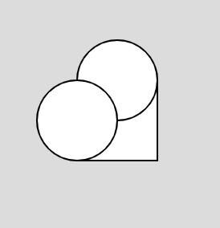

### Let's Rotate!
Before we jump into the code, we need to talk about how drawing in p5 works. As you know the origin, x:0 y:0, is at the top left corner of the canvas. 


For an example, I'm going to draw a square, and then rotate it. We'll return to the heart in a little bit. 
```javascript
rect(50, 50, 50, 50) //simple square!
```

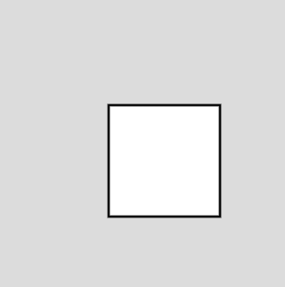

There is a function called rotate that will rotate the entire drawing context around the origin. So I'm going to rotate it 30 degrees, or PI/6 radians.
```javascript
rotate(PI/6)
rect(50, 50, 50, 50)
```
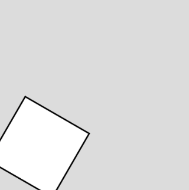

Notice, the square is rotated in the clockwise direction. The center of rotation is the origin, x:0 y:0! If I rotate more, the square will be rotated off the screen!

```javascript
rotate(PI)
rect(50, 50, 50, 50)
```


So instead, I want to rotate around a different point, maybe the corner of the square. I need to move the origin to a different location, we do this with the `translate` function.  

```javascript
translate(50, 50); //moving the origin
rotate(PI/6)
rect(0, 0, 50, 50) //drawing at the origin!
ellipse(0,0,20,20) //adding a circle at the origin.
```
  
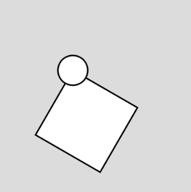

Consider this code.
```javascript
translate(50, 50); //moving the origin
rotate(PI/6)
rect(0, 0, 50, 50) //drawing at the origin!
ellipse(0,0,20,20)
ellipse(width/2, height/2, 50, 50); //should be at the center
```

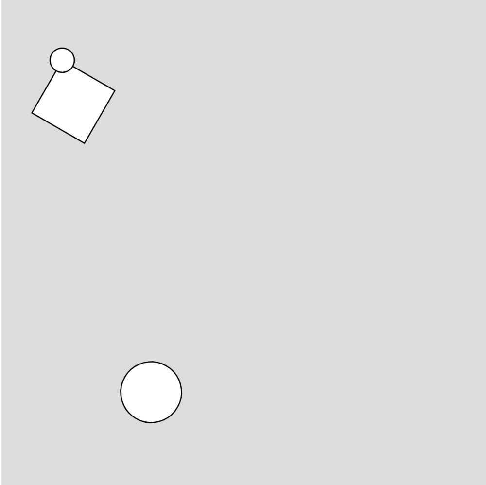

The next shape we draw will be effected by our translate and rotate. So if we want the next shape to be at the center of the canvas, we are in trouble.

The fix is simple. If we start our drawing with `push();`, it will create a new drawing context. To reset the origin back, we call `pop();`. This will return the origin to the top left corner of the screen.

Here is our final code.
```javascript
push(); //new drawing context
translate(50, 50); //moving the origin
rotate(PI/6)
rect(0, 0, 50, 50) //drawing at the origin!
ellipse(0,0,20,20)
pop(); //stop the drawing context
ellipse(width/2, height/2, 50, 50); //back be at the canvas center, no more rotation.
```
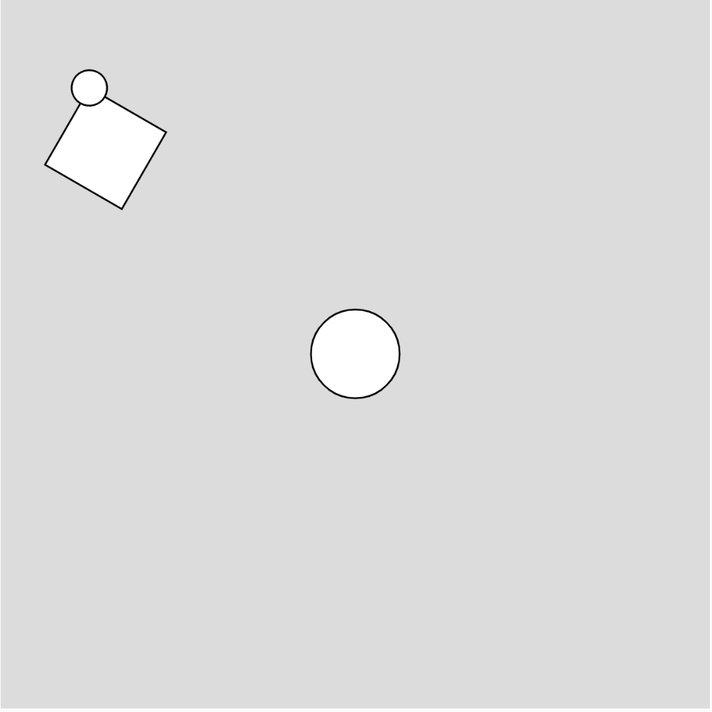

### Applying Rotate to Our Heart
We can apply this idea to our heart.
```javascript
push();
translate(50, 50); //make this the center of our heart
rotate(PI/-4); //rotate the drawing context for the heart
fill("red"); 
ellipse(0, 0, 50, 50); //draw the first circle at the cnter
rect(-25, 0, 50, 50); //draw the square, move the x position half the width of the square
ellipse(25, 25, 50, 50) //draw the other circle, move it over and down half the width of the circle
pop();
```
 
  

## Part 2 - Changing the Size
In Part 2, you will see how to use variables to make a circle of any size. 

[Link to  Video](https://youtu.be/ANdflj_1TaY)

If we just change the size of the square and the ellipses, the spaces will be way off!

```javascript
push();
translate(50, 50);
rotate(PI/-4);
fill("red");
ellipse(0, 0, 100, 100);
rect(-25, 0, 100, 100);
ellipse(25, 25, 100, 100)
pop();
```
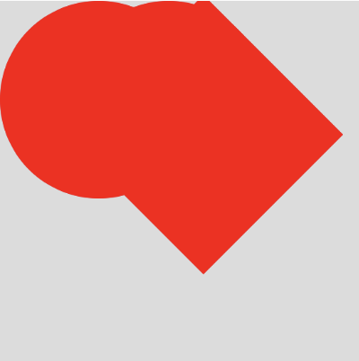  
 
We can change this by using a variable for the size, and then doing a little math to figure out the placement of the square and circles. 
```javascript
let heartSize = 50a //variable for the heart size;
```

Now, we will put `heartSize` instead of a number for all the size parameters in our drawing! 

We still have to deal with the spacing. You might remember that we move our rectangle to the left by 25, which was half of it's size. Since we are no using a variable we can let p5 do the math for us!
```javascript
rect(-heartSize/2, 0, heartSize, heartSize);
```

The second ellipse will also be changed.
```javascript
ellipse(heartSize/2, heartSize/2, heartSize, heartSize);
```

Now if we change the `heartSize` variable, these values automatically update!

Here is our final heart code.

```javascript
push();
let heartSize = 100;
translate(width/2, height/2);
rotate(PI/-4);
fill("red");
ellipse(0, 0, heartSize, heartSize);
rect(-heartSize/2, 0, heartSize, heartSize);
ellipse(heartSize/2, heartSize/2, heartSize, heartSize);
pop();
```
  
