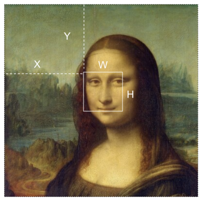

# Advanced Image Manipulation
Once you have an image in p5, you can access any and all pixel data associated with image. You can grab and edit a single pixel, or grab sub sections of an image.

## Getting Pixel information
There are different methods to get pixel information. Each has its pros and cons.

### Pixels
You can access the raw pixel data for any image, but this gets pretty complicated fast! Here is a code sample.

```javascript
img.loadPixels(); //this loads the the pixel data
print(img.pixels); //dumps all pixel information to the console, might crash your browser depending on how big the image is.
```

Here is an example of what could be printed: `[ 104, 116, 94, 255, 100, 112, 90, 255, 91, 103, … ]`

The square brackets show that this is an *array*, fancy talk for a list. All the pixel data for the entire image is stored in the array. Each pixel is represented by 4 values.


This can be useful and very *fast*, but we need to do a bunch of math to translate this 1 dimensional array into useful image data.

### `get()` method
The `get()` method is easier to work with, but not as speedy. It has multiple forms:

- `img.get()` - without any arguments, this will get the entire image
- `img.get(x,y)` - with two arguments, this will get a single pixel at the given x,y cordinate.
- `img.get(x, y, w, h)` - with four arguments, this will get a portion of the larger image.

Here is a simple example where we get the color at a random point and draw a circle with the color of the pixel.

```javascript
let img;
let pixelColor;

function preload(){
  img = loadImage('/imgs/mona.jpg')
}

function setup() {
  createCanvas(img.width, img.height); //set the canvas to match the image size
  noStroke();
  image(img, 0, 0); //draw the image once
}

function draw() {
  let x = random(0, width);
  let y = random(0, height);

  pixelColor = img.get(x,y); //get a single pixel

  fill(pixelColor);
  circle(x,y, 20)
}
```

Here is the result!


Here is an example where we can get a sub section of an image.
```javascript
let img;
let thumb;

function preload(){
  img = loadImage('/imgs/mona.jpg')
}

function setup() {
  createCanvas(400, 400);
  thumb = img.get(164, 143, 80, 80); //grab a sub section of the image
}

function draw() {
  background(220);
  image(thumb, mouseX, mouseY); //draw the sub image at the mosue pointer
}
```

Here is a visual that shows how the sub section is calculated:


With `get()` the possibilities for manipulation are pretty endless. We could weave two images together. We could split the image into tiles and randomize the order.

## A Final Example
Inspired by a [manipulated photo](https://www.instagram.com/p/Cw-nYXYIEny/?img_index=4) by [Kensuke Koiko](https://www.kensukekoike.com/), I wanted to make a p5 version that would work with any image.

First I use a for loop to layout a grid of smaller squares on Mona.


Using this same geometry, I grabbed a subsection of the image at each square and stored it into an array called thumbs.

I then display each thumb, enlarging them to fill the canvas.


You can see the code [here](https://github.com/awdriggs/codedImages/blob/main/bitmona/sketch.js)
