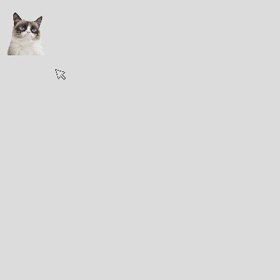
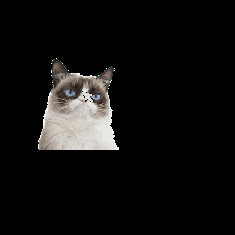

# Working with Images
This guide will show you how to load, display, and size images in p5.

## Add the Image File to the Sketch
While signed into the p5 editor you can load images from your computer.
* Click the  to open up the sketch folder.
* Click  to add files from your computer.

It's advisable to not have any spaces in your filename. You're life will just be easier that way. You should edit the file names before you upload or right click the image file to rename.
If you are going to have a bunch of images, you might want to put them all in a folder.

## Loading an Image
Once we have an image in our sketch, we will want to load an image before the rest of the program loads. p5 has a `preload` function that gets called before setup and draw. This is the place to load any media you are going to use in your sketch to make sure it loaded before the sketch starts..

```javascript
let img; //declare a variable for use later on.

function preload() {
  img = loadImage('./title.jpg'); //this image must be in the same folder as the sketch code
}
```
The example above assume that the images have been loaded into the same folder as your `sketch.js` file.

If the images are in a subfolder, the file path for the image will need to change.
```javascript
img = loadImage('./pics/title.jpg'); //images are in a subfoldeer called pics
```

The `loadImage` function returns a p5 image object. We are assigning this object to the variable `img`. The name of variable would be any valid javascript variable name.

### Loading from the Web
You can also use a url to access an image, but if that url ever changes you code break!
`img = loadImage('URL');`

## Display an Image
Once an image is loaded, we can display it on the canvas.
Inside `draw()`, add this line of code to display your image.

```javascript
function draw(){
  background(255); //white bg

  image(img, 200, 200);
}
```

The `image` function can take in a few parameters that determine how an image is displayed.

```javascript
image(img, x, y, [width], [height])
```
  - `img`, the image object to display
  - `x`, the horizontal position, left side of the image
  - `y`, the vertical position, top side of the image
  - `width`, optional, sets the width
  - `height`, optional, sets the height

## Sizing an Image
The `width` and `height` above will force an image to a specific size, and will stretch or squeeze the image and not maintain an image's proportions. Maybe this is what you want, but if you want to keep an image's aspect ratio the same, you can use the `Image.resize()` method. 

This line will force an image to be 200 by 200 pixels, regardless of the original image's proportions.
```javascript
displayImage.resize(200, 200)
```
Different from the setting the width and height when displaying using `image()`, `Image.resize()` will replace the image with a resized image for the remainder of the sketch. 

The line below will set an image width to 400, but will automatically calculate the image's height proportional to the width. 
```javascript
displayImage.resize(400, 0)
```
And this line will change the height to 400 and calculate the width automatically.
```javascript
dispalyImage.resize(0, 400)
```

## Dynamic Sizing
The any value can be set as parameters of the `image()` function, this will stretch or squeeze the image. 
```javasript
  function draw() {
    background(220);

    image(img, 0, 0, mouseX, mouseY);
  }
```
Now moving the mouse changes the size of image! Notice that the original proportion is lost.
 
If we want to keep the same proportion, the values could be changed by some scale factor like this:
```javascript
function draw() {
  background(220);
  let scalar = mouseX/width;
  image(img, 0, 0, img.width * scalar, img.height * scalar)
}
```


You might be thinking "Wouldn't `img.resize(mouseX, 0)` work and be simpler?" But when we call `img.resize(mouseX, 0)` we are replacing the image with the resized copy, if we size it down then try to size it up we will lose valuable pixel and the image will degrade.
 
An alternative would be to create a copy of the image or scaling using `img.get()`. This is computationally more "expensive" and could slow down a sketch depending on the image size.

```javascript
function draw() {
  background(220);
  let displayImage = img.get(); //creates a copy of the original image
  displayImage.resize(mouseX, 0)
  image(displayImage, 0, 0)
}
```

The `get()` method will be explained in more detail in the next tutorial.

## Positioning an Image
The x and y position of the image refers to the top left corner of the image, like a `rect`. A little math can be used to center an image.

```javascript
function draw() {
  background(220);
  let w = mouseX; //image width
  let h = mouseY; //image height
  image(img, width/2 - w/2, height/2 - h/2, w, h); //center image in the canvas
}
```

You can also change image to draw from the center instead, like an `ellipse`. You do this by putting `imageMode(CENTER);` in your setup function.

## "Paint" with the image
We can position the image however we like, for example we could have to follow the mouse.

```javascript
image(img, mouseX - img.width / 2, mouseY - img.height/2); //make it centered on the mouse
```


Now whenever we move the mouse the image follows. Try removing the `background()` at the start of draw. Now we can see a history of where the mouse has been.

We can easily make it so it only draws the image when the mouse is pressed. Wrap this around the image code.

```javascript
if(mouseIsPressed == true){ //only paint the image when the mouse is pressed.
  image(img, mouseX - img.width / 2, mouseY - img.height/2);
}
```


# Up Next 
See how to manipulate pixel data in the [advanced images guide](./advanced.md)
