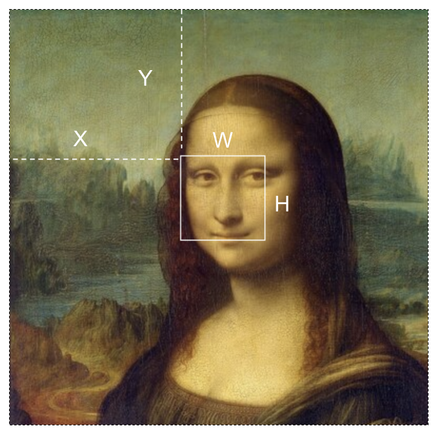
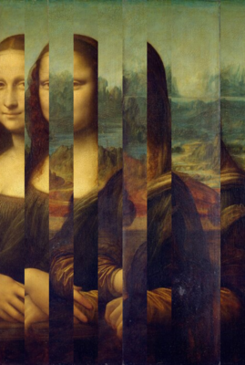
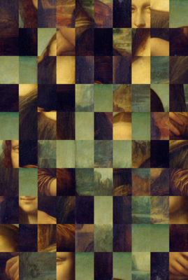
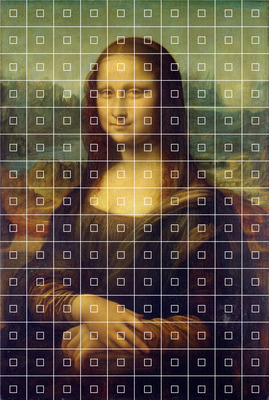
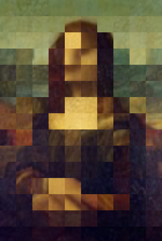

# Splitting Up an Image 

## Grabbing a subsection of an image
When `Image.get()` is given 4 parameters, it will take a rectangular section of the image.

`Image.get(x, y, w, h)`
- `x`: Horizontal location of cutting rectangle
- `y`: Vertical location of cutting rectangle
- `w`: Width of the cutting rectangle
- `h`: Height of the cutting rectangle

Here is a visual that shows how the sub section is calculated:



Here is an example where we can get a sub section of an image.
```javascript
let img;
let thumb;

function preload(){
  img = loadImage('/imgs/mona.jpg')
}

function setup() {
  createCanvas(400, 400);
  thumb = img.get(164, 143, 80, 80); //grab a sub section of the image
}

function draw() {
  background(220);
  image(thumb, mouseX, mouseY); //draw the sub image at the mosue pointer
}
```

## Using an Array to Store and Display Parts of an Image
Arrays are a data structure that can hold multiple items. We can use an array to store slices of an image. 

### One-Dimensional, Slices
This example shows how to slices the image into segments and display the segments as horizontal strips.
```javascript
let mona;
let numSlices;
let sliceWidth;
let slices = [];

function preload() {
  mona = loadImage("./mona-lg.jpg"); //this image must be in the same folder as the sketch code
}

function setup() {
  createCanvas(mona.width, mona.height);
  numSlices = 10;
  sliceWidth = mona.width / numSlices;

  slicify();  //slices image up and adds to the slices array

  noLoop();
}

function draw() {
  background(220);
  displayImage();
}

function mousePressed() {
  redraw();
}

function slicify() {
  //loop from 0 to number of slices
  for (let i = 0; i < numSlices; i++) {
    let slice = mona.get(i * sliceWidth, 0, sliceWidth, height); //cut out part of t eimage
    slices.push(slice); //add this slice to the slices array.
  }
}

//display the image
function displayImage() {
  slices = shuffle(slices); //randomize the array

  let x = 0; //keep track of horizontal position

  for (let i = 0; i < slices.length; i++) {
    image(slices[i], x, 0);
    x += sliceWidth; //move horiziontlly
  }
}
```
 

### Two-Dimensional, Grid
Now that we have the code to make slices, we can put that inside another for loop to get a grid of image cells

```javascript
let mona;
let numRows, numCols;
let cellWidth, cellHeight;
let cells = [];

function preload(){
    mona = loadImage('./mona-lg.jpg'); //this image must be in the same folder as the sketch code
}

function setup() {
  createCanvas(mona.width, mona.height);
  numCols = 10; //control the grid
  numRows = 10;
  cellWidth = mona.width/numCols;
  cellHeight = mona.height/numRows;
  print(cellWidth, cellHeight)

  gridify(); //create an image grid

  print(cells.length);
  noLoop(); 

}

function draw() {
  background(220);
  displayImage();
}

function mousePressed(){
  redraw()
}

function gridify(){
   for(let i = 0; i < numRows; i++){
    for(let j = 0; j < numCols; j++){
      //grab a subsection of the image
      let cell = mona.get(j * cellWidth, i * cellHeight, cellWidth, cellHeight);
      cells.push(cell); //add to the array of image cells
    }
  }
}

//display the image
function displayImage(){
  cells = shuffle(cells); //randomize the array

  let x = 0;
  let y = 0;

  for(let i = 0; i < cells.length; i++){
    image(cells[i], x, y); //display a cell

    x += cellWidth; //move horiziontlly

    if(x >= width){ //break to next line
      x = 0;
      y += cellHeight; //move vertically
    }
  }
}
```
 

With `get()` the possibilities for manipulation are pretty endless. We could weave two images together. We could split the image into tiles and randomize the order.

## A Final Example
Inspired by a [manipulated photo](https://www.instagram.com/p/Cw-nYXYIEny/?img_index=4) by [Kensuke Koiko](https://www.kensukekoike.com/), I wanted to make a p5 version that would work with any image.

First I use a for loop to layout a grid of smaller squares on Mona.



Using this same geometry, I grabbed a subsection of the image at each square and stored it into an array called thumbs.

I then display each thumb, enlarging them to fill the canvas.



You can see the code [here](https://github.com/awdriggs/codedImages/blob/main/bitmona/sketch.js)
