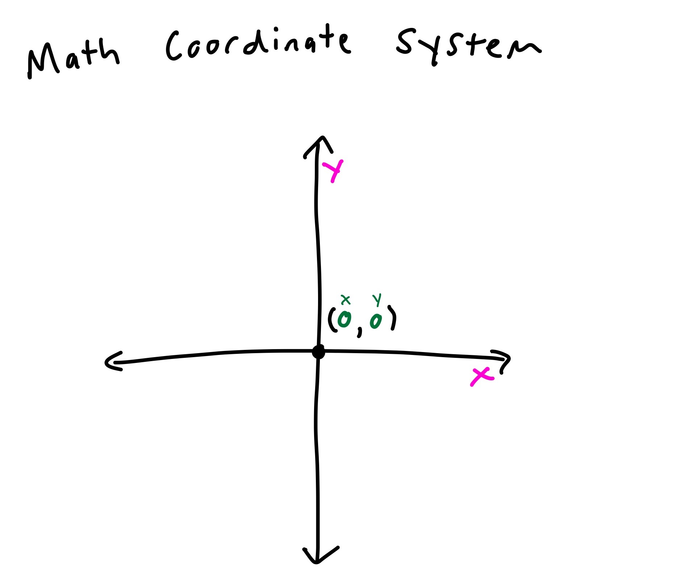
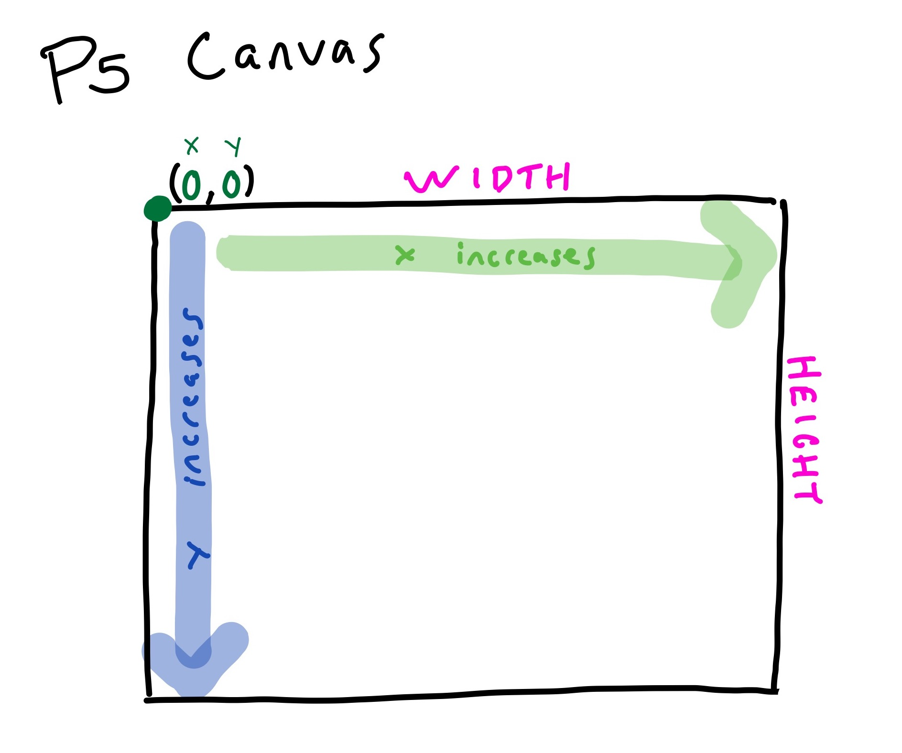

# Positioning Shapes

When trying to position where things are drawn, it is important to understand how coordinates work in p5.

In math we have the standard coordinate plane with the x/y axis with the origin in the center. 



In p5, the coordinate system starts with the origin in the left corner.


 
## Try it out!
One way to help figure our where to position an object is to see where the mouse is. Putting this code at the top of your draw loop will show the coordinates of the mouse location.
```javascript
text("X: " + mouseX, 20, 20);
text("Y: " + mouseY, 20, 40);
```

