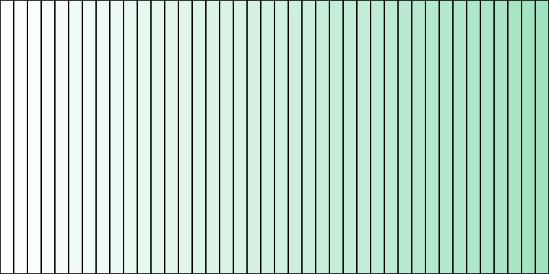
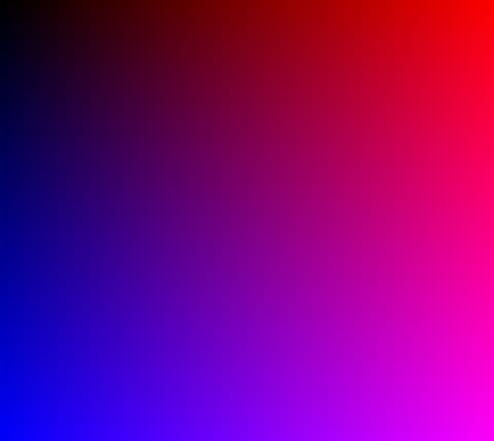
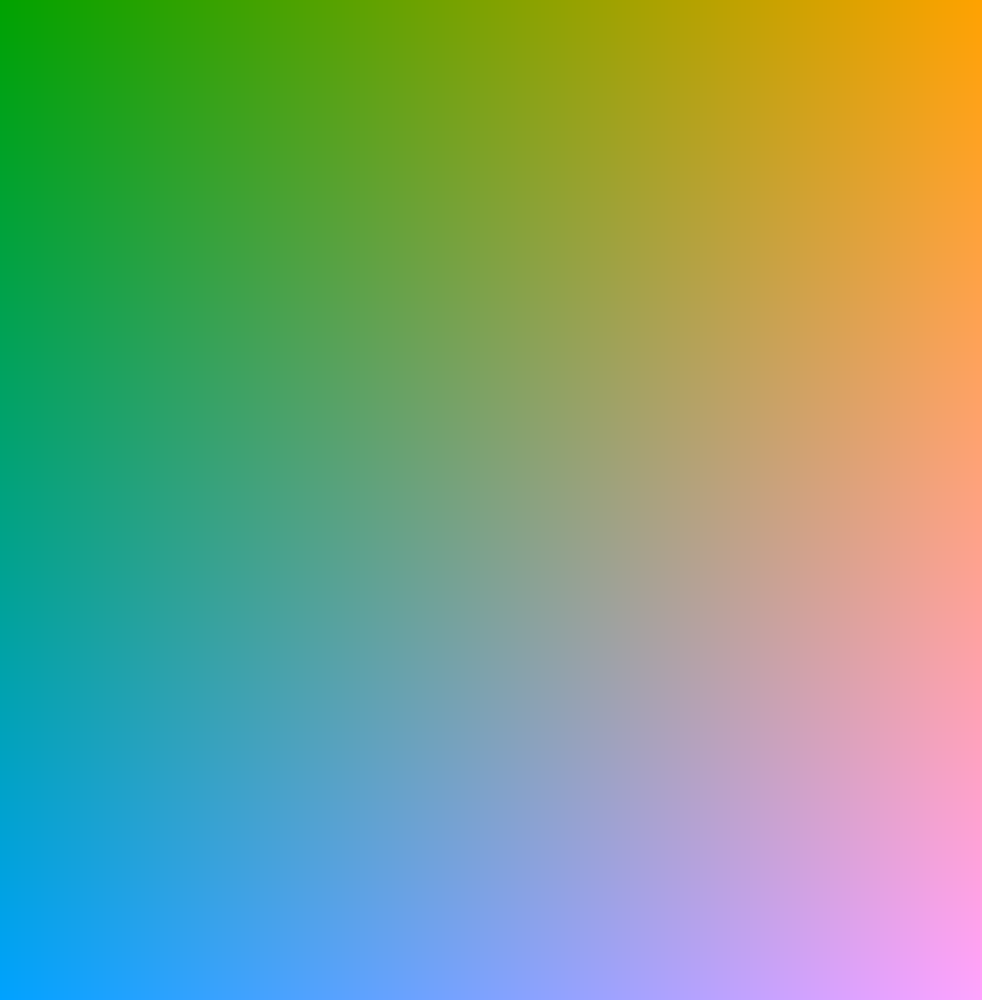
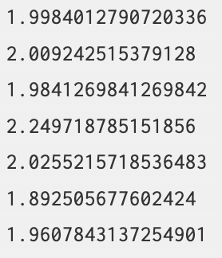
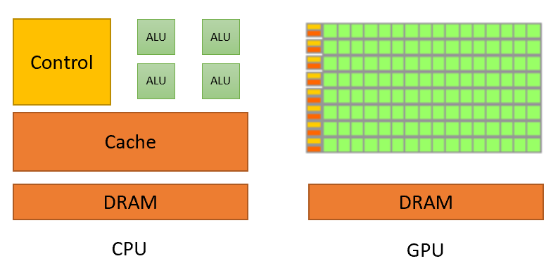

# Shader Case Study #1 - Gradients

## Objective
Learn some basics about shaders without being overwhelmed.

## Background
In this tutorial we'll look at the "hello world" of shaders, a gradient. We'll start by making a interactive color gradient in two ways without shaders and exam their performance in p5.
Then we'll create a gradient using a shader, and hopefully this will reveal the why and how of this magical thing we call shaders. This of this as a TLDR introduction to shaders.
[Here](./resources.md) are the resources that informed this tutorial and can be used to go deeper with shaders.

## Sketch #1 - A Gradient with `rect`
A gradient is a nice way to some panache to your sketch. If you are after a simple gradient, `lerpColor()` has what you need.

;

```javascript
let startColor, endColor;

function setup() {
  createCanvas(400, 200);
  startColor = color(255, 255, 255);
  endColor = color(0159, 226, 191);
}

function draw() {
  background(220);

  let rectWidth = 10;

  for(let x = 0; x < width; x+=rectWidth){
    let gradientColor = lerpColor(startColor, endColor, x/width);
    fill(gradientColor);
    rect(x, 0, rectWidth, height);

  }
}

function mousePressed(){
  saveCanvas('myCanvas.png');
}
```

When we want to create a 2D gradient, then we need to make a grid of rectangles, decide the fill, an then draw them. The code below does this with a nested for loop.

;

```javascript
function setup() {
  createCanvas(windowWidth, windowHeight);
  noStroke();
}

function draw() {
  background(220);

  for(let x = 0; x < width; x+=10){
    let r = map(x, 0, width, 0, 255);
    for(let y = 0; y < height; y+=10){
      let b = map(y, 0, height, 0, 255);
      fill(r, 0, b);
      rect(x,y, 1, 1);
    }
  }
}
```
Not too bad! You may notice that you can tell where the squares begin and end. Lets make the square size just 1px so that each pixel is a unique color.

[Here is a link to play along](https://editor.p5js.org/awdriggs/sketches/WhG9zstyO)

Updated for loop.
```javascript
let x = 0; x < width; x+=1){
  let r = map(x, 0, width, 0, 255);
  for(let y = 0; y < height; y+=1){
    let b = map(y, 0, height, 0, 255);
    fill(r, 0, b);
    rect(x,y, 1, 1);
  }
}
```
 
Here is the result.

;

Now we have a smoother gradient, but it always the same. Let's change it to make the mouse control the green value. Add this line before the for loop, `let g = map(mouseX, 0, width, 0, 255);`

And update the `fill()` on line 13 to this this: `fill(r, g, b);`

Run the sketch again, move the mouse around the canvas to change the gradient. What do you notice?
 


It's slow! Just how slow? Add this line to the end of draw: `print(frameRate());` to get the current frames per second. Run the sketch again and see the console output.
Here is the framerate when running the sketch in the chrome browser on a 2023 macbook air.



There is a slightly better way to do this by treating the canvas an image and assigning each pixel in the image to a color. This is faster by not by much. 
Check out [this sketch](https://editor.p5js.org/awdriggs/sketches/cN566vfi-) to see for yourself. The same computer was running this example at 20 frames per second. A 10x increase but still not 60 frames per second like most sketches.

# A Much Better Way. Shaders!

A shader will be able to perform much better at making this gradient. Showing is more powerful then telling, so start by opening up this sketch and running it. Make sure to look at the frame rate in the console.

[Gradient with a Shader](https://editor.p5js.org/awdriggs/sketches/eMYKcun4r)


 
What is this magic? Is a shader! We'll go through it and how it works.

Here are the absolute basics that you need to know before moving on.

- We have to change setup to create a canvas with webgl like this: `createCanvas(windowWidth, windowHeight, WEBGL);`
- We will use p5 to create shapes, in this example we'll have one rect that covers the entire canvas.
- p5 will send the all the geometry points of a shape to another file with the `.vert` file extension. This is the vertex file and is responsible for handling all the geometric calculates for the shader, in this case really just doing a translation of the canvas space into webgl space.
- The `.vert` file sends each information to create each pixel to a file ending with `.frag`. This file is responsible for deciding how to "paint" each pixel.
- Both of those files need to be in the same folder as the sketch and loaded with the `preload()` function as inputs to the `loadShader()` p5 function.
- We need a way to pass information from p5 to the shader, this is done through "uniforms". This is a one way street! The Shader can't pass information back to p5.

It's ok if that doesn't make 100% sense right now. We are going to dive into the deep end and look at the complete file. Read the comments carefully to try and understand what is happening in the sketch.

```javascript
let theShader; //a variable to hold or shader

function preload(){
  // load the shader with the vert and frag file
  theShader = loadShader('shader.vert', 'shader.frag');
}

function setup() {
  // disables scaling for retina screens which can create inconsistent scaling between displays
  pixelDensity(1);

  // shaders require WEBGL mode to work
  createCanvas(windowWidth, windowHeight, WEBGL);
  noStroke();
}

function draw() {
  shader(theShader); // shader() sets the active shader with our shader

  //uniforms are how we pass data from p5 to the shader.
  theShader.setUniform("u_resolution", [width, height]); //this tells the shader the size of the canvas
  theShader.setUniform("u_mouse",[mouseX, 0]); //this tells the shader where the mouse is at this moment.

  // rect gives us some geometry on the screen
  rect(0,0,width, height);
}

```

That's it! No for loops or anything. 

## Vertex Shader
Let's jump over to the `.vert` file to see what is happening there. Remember, this file is for converting points in space from the p5 to the shader context. It will be applied to each vertex point given by p5.
```glsl
// adapted by code shared by adam ferriss
// https://github.com/aferriss/p5jsShaderExamples

// a single vertex position, attribute is the shader equivalent of a variable 
// notice the data type, it is a 3 value vector 
attribute vec3 aPosition;

// our texcoordinates
attribute vec2 aTexCoord;

// this is a variable that will be shared with the fragment shader
// we will assign the attribute texcoords to the varying texcoords to move them from the vert shader to the frag shader
// it can be called whatever you want but often people prefiv it with 'v' to indicate that it is a varying
varying vec2 vTexCoord; 

void main() {

  // copy the texture coordinates
  vTexCoord = aTexCoord;

  // copy the position data into a vec4, using 1.0 as the 4th component marks the vec4 as a position.
  vec4 positionVec4 = vec4(aPosition, 1.0);
  positionVec4.xy = positionVec4.xy * 2.0 - 1.0; //this is a little hacky way to get the image centered in p5 canvas.

  // this sends the vertex data to the fragment shader
  gl_Position = positionVec4;
}
```

This is a fairly standard .vert file and can be used for any 2D application that fills the canvas, like an image or a video.

## Fragment Shader
Time to look at the `.frag` file. This is the file for determining what an individual pixel will look like.

A few things to note.
- You see `vec` all over the place. This is for vector, they come in different flavors; 2d, 3d, and 4d. If you are unfamiliar with vectors think about them was a way to express a point in space, like your (x,y) coordinates from High School math.
- All values need to be decimal numbers. Don't forget this. 
- All vector values are normalized, meaning they should be values between 0.0 and 1.0. This is one of the ways shaders optimize complex math. 

```glsl
// This bit sets the precision of the shader. In this case we'll use a medium percision.
// A higher percision will give a better output, but will be slower.
#ifdef GL_ES
precision mediump float;
#endif

// Here the "uniforms" from p5 are declared so we can use them.
uniform vec2 u_resolution;
uniform vec2 u_mouse;

// This is the same variable that was declared in the vertex shader
// Declaring it here necessary to receive the data from the vertex shader.
varying vec2 vTexCoord;

void main() {

  // normalizes mouse coordinates as a value between 0.0 and 1.0
  float n_mouse = u_mouse.x / u_resolution.x;

  // copy the vTexCoord
  // vTexCoord is a value that goes from 0.0 - 1.0 depending on the pixels location
  // i.e. (0.5, 0.5) would be the middle fo the screen.
  // we can use it to access every pixel on the screen
  vec2 coord = vTexCoord;

  // The x values for red channel, y values for blue channel
  // The green channel is the normalized mouse position!
  vec3 color = vec3(coord.x, n_mouse, coord.y);

  gl_FragColor = vec4(color, 1.0 ); //This sets the color of a pixel.
}
```
 
Play around with this code! Change the values and see what happens.  

## So what's going on here?
Shaders do their magic by having the CPU offload calculations to the GPU. What the what? To break it down...
- CPU, Central Processing Unit. Often talked about as the "brains" of the computer. But I prefer train dispatcher. The CPU is responsible for directing all flow of data within a computer. A single CPU can do one task (thread) at a time, in sequence. You're CPU probably has a 2 or more CPU "cores."
- GPU, Graphical Processing Unit. This is another chip that lives in your computer. A GPU is a math prodigy. It has been designed to compute math functions extremely fast. A GPU has many threads, so can simultaneously calculate many things at the same time! 

A typical p5 sketch runs 100% on the CPU. Like the first gradient, the CPU must calculate the color for each of the millions of individual pixels on the screen.

A p5 sketch that uses a shader breaks up all this work and sends it over to the GPU for processing. The multiple threads on the GPU allows for it to do multiple calculations at the same time. The task is split up and sent to the different threads. A single thread will do calculations one after another until the entire task is complete.

Here is a classic way of showing the difference between the two processors from [Nividia](https://blogs.nvidia.com/blog/whats-the-difference-between-a-cpu-and-a-gpu/).

.

All of those green blocks are Arithmetic Logic Units, the math parts of a processor. Notice how many each thread of the GPU has compared to the CPU. 

Right now this seems trivial, we are just making a gradient after all. But this is an illustration of the speed of a shader, and this becomes much more impressive once we start operating on images, videos, or complex 3d environments. The subject of future tutorials.

## Closing Notes
As you hopefully embark on your shader journey, here are some keys to save you some time and tears.
- Data from is one way. The p5 sketch can pass variables to the shader, but the shader can't pass data back.
- Each shader fragment is independent and can't know what is happening with the other fragments.
- There is not `console.log()` in shader land, show debugging can be a pain. And error messages aren't great. General advance is to use a bright color like (0, 1.0, 0), green, to see where pixel.
- Don't forget, use a floating point number for everything. Never forget your decimal point!

