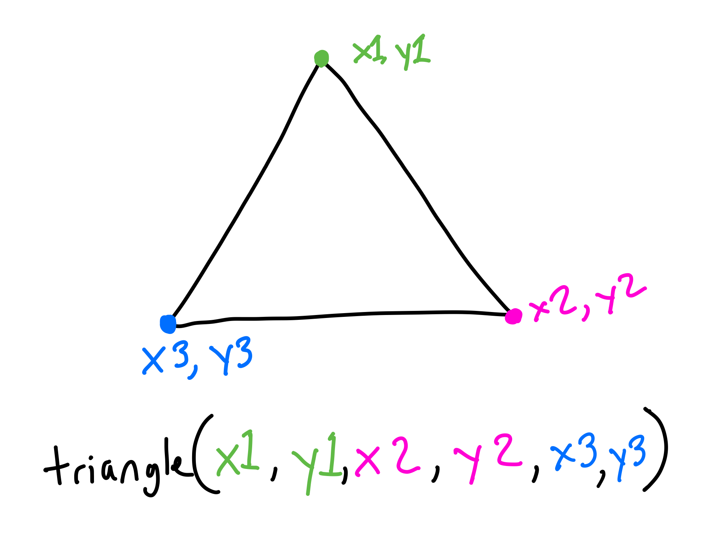
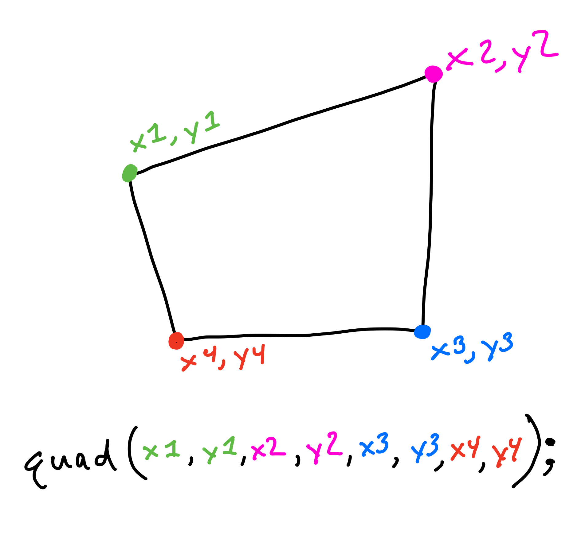
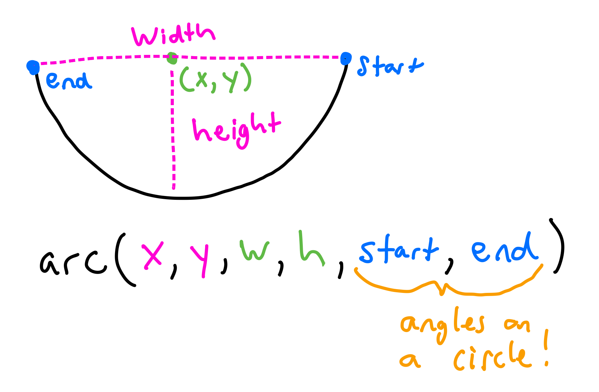
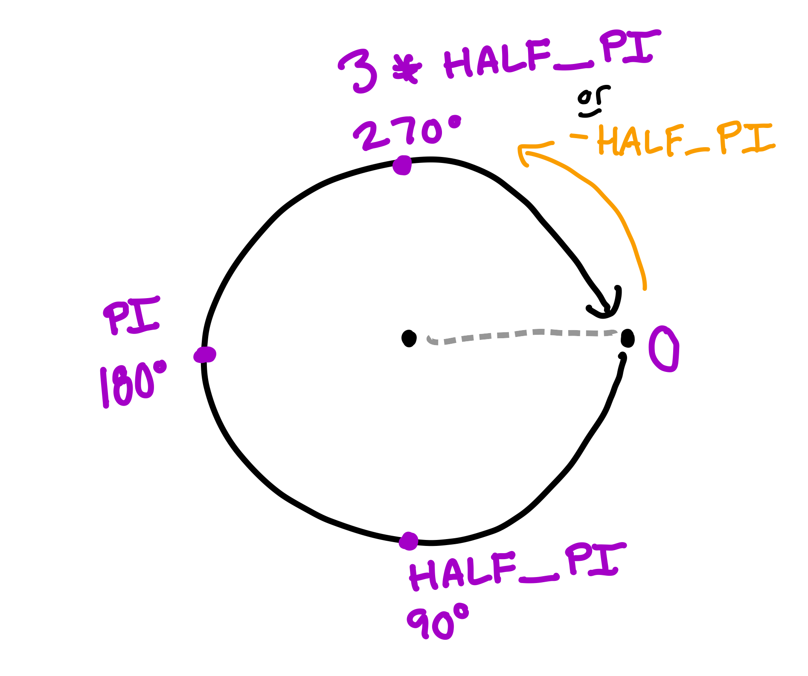
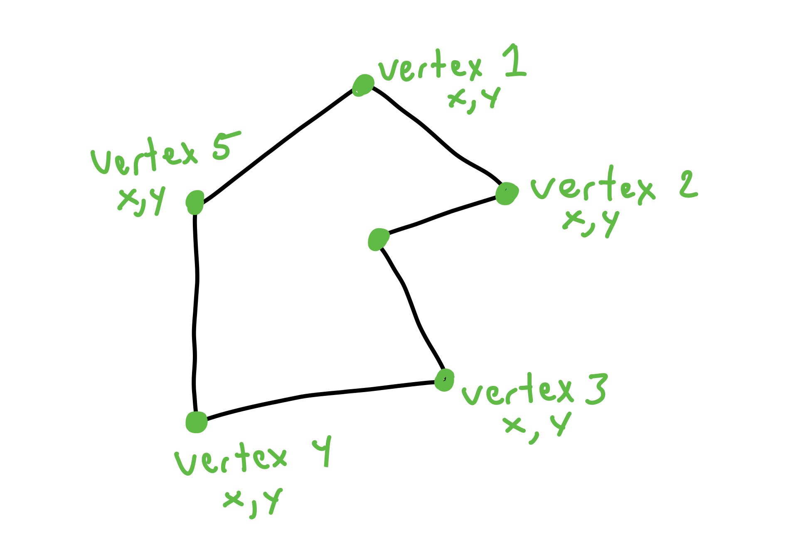

# Advanced Shapes

## Menu
- [Triangle](#triangle)
- [Quad](#quad)
- [Arc](#arc)
- [Polygon](#polygon)

## Triangle
In p5, a triangle is made from the three corner points, connected with a line.

```javascript
triangle(x1, y1, x2, y2, x3, y3);
```



You can put the points in any order, it wouldn't change the final shape.
 
```javascript
triangle(100, 30, 170, 170, 30, 170);
```


```javascript
triangle(30, 30, 170, 170, 30, 170);
```


```javascript 
triangle(100, 30, 190, 100, 30, 170);
```


## Quad

A quad is any four sided shape with four corners, but the sides don't have to be parallel like a rectangle or square. A quad is created using the four corner points. In this way it is really similar to a triangle. 

```javascript
quad(x1, y1, x2, y2, x3, y3, x4, y4);
```



```javascript 
quad(100, 30, 190, 100, 30, 170, 30, 90);
```


Crazy shapes can happen when a point "crosses over" the line draw by previous points.

```javascript
quad(190, 160, 190, 100, 30, 170, 30, 90);
```


## Arc
An arc is a part of an ellipse. The code is similar to the code for an ellipse, with two more parameters.

```javascript
arc(x, y, w, h, start, end);
```



Start and End are the angles around a circle of where to start and stop the arc. In p5, angles are written as [radians](https://www.mathsisfun.com/geometry/radians.html) and not degrees. You'll learn more about this in high school Trigonometry. For now we will keep it really simple. In p5 we can use `PI` for 180 degrees. If we want 90 degrees we can just do `PI/2`. 



Here are some examples.

```javascript
arc(100, 100, 150, 150, 0, PI)
```


```javascript
arc(100, 100, 150, 150, PI, 0)
```


 
```javascript
arc(100, 100, 150, 150, 0, PI/4); //pizza!
```


## Polygon
You can draw a polygon with any number of sides using the `beginShape()` and `endShape()` functions. Each point of the polygon should be used in a `vertex(x,y)` function.



```javascript
beginShape();
vertex(30, 80);
vertex(85, 20);
vertex(160, 60);
vertex(100, 75);
vertex(120, 170);
vertex(30, 180);
endShape(CLOSE);
```
 

  
