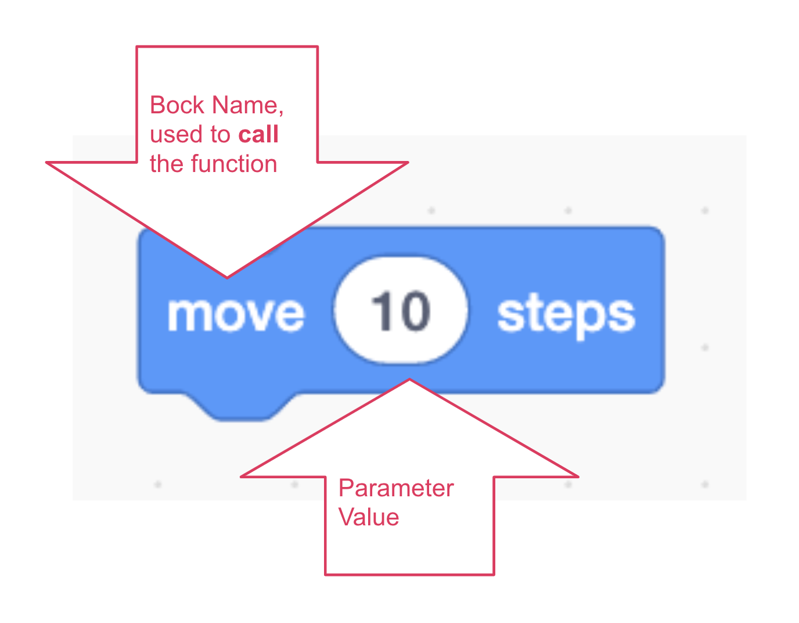
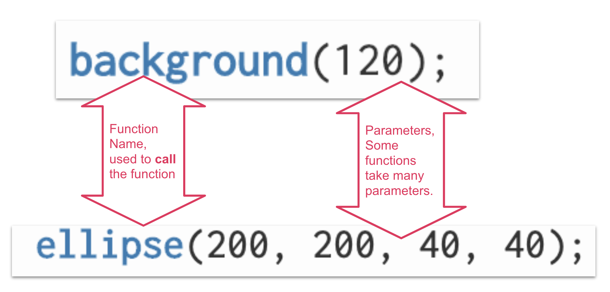
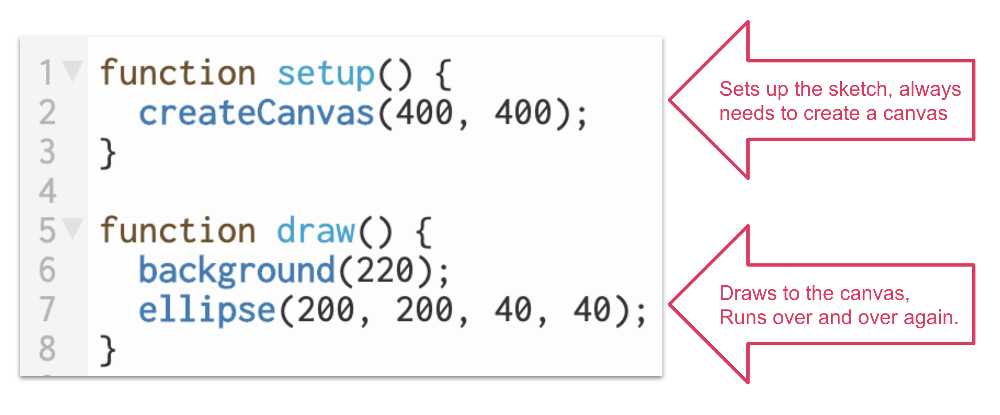

# Introduction to p5!

## Functions
P5 is a library of *functions*. A function is simply a block of code that does a task.

We call a p5 project a sketch, as in sketchbook, because they are quick to start!

Think of it like a scratch block. A Scratch block has a name and usually takes in a value or *parameter*.

A function is the same idea. Each function has a name that we can use to *call* the function. Most functions take one or more parameters. Some functions take no parameters.

To draw a circle use can use the ellipse function, and give it 4 parameters.

### Exploration
* Check out this starter code.
* Try changing the parameters to different values.
* Click the play button to run the code.
* What happens when you change up the values?

For more on drawing circles, check out the [Circles page](./circles.md).

## Basic Setup
For every sketch, two functions most defined for the sketch to run properly.

The [p5 editor](https://editor.p5js.org/) automatically includes these for you. You can change the values to change the canvas size and the background color.

